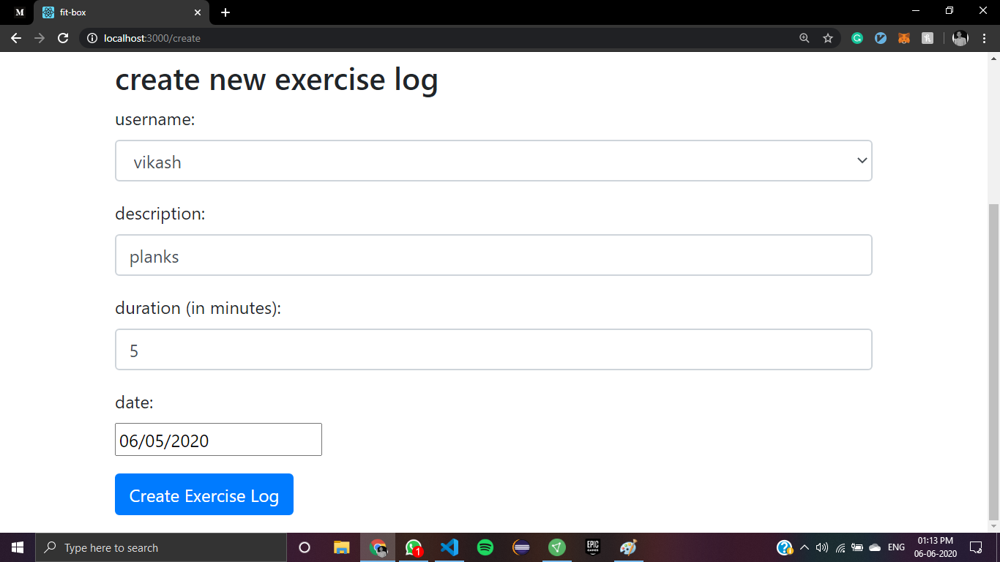
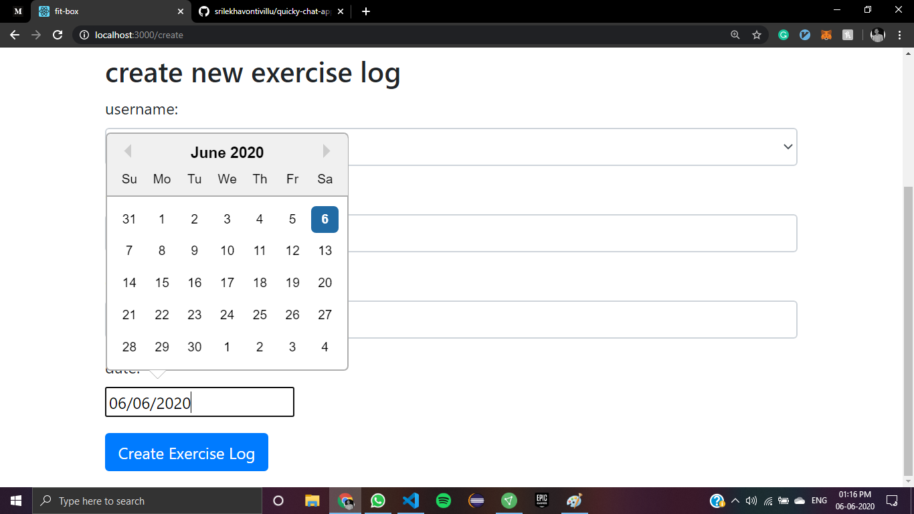
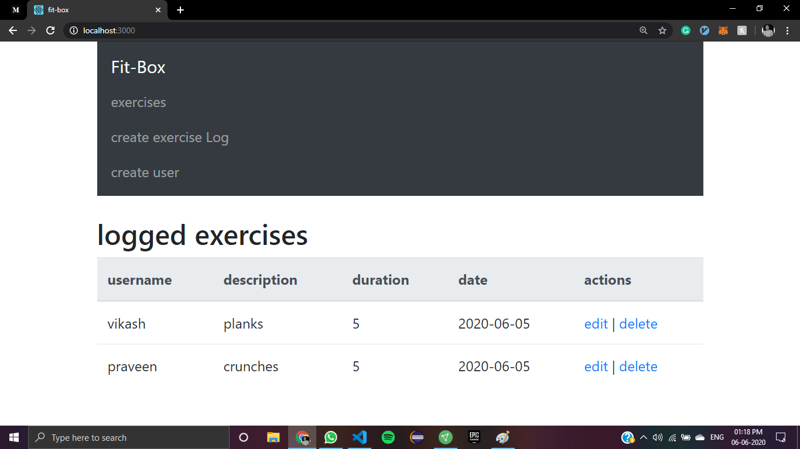

Fit-Box

a web-app developed using MERN stack (MongoDB,Express.js,React.js,Node.js) , which can perform create, update, read, delete operation.

screenshots of web-app
Create user:

update exercise:

Exercise log:

Delete exercise:

MongoDB Atlas:
user database:

exercise database:

